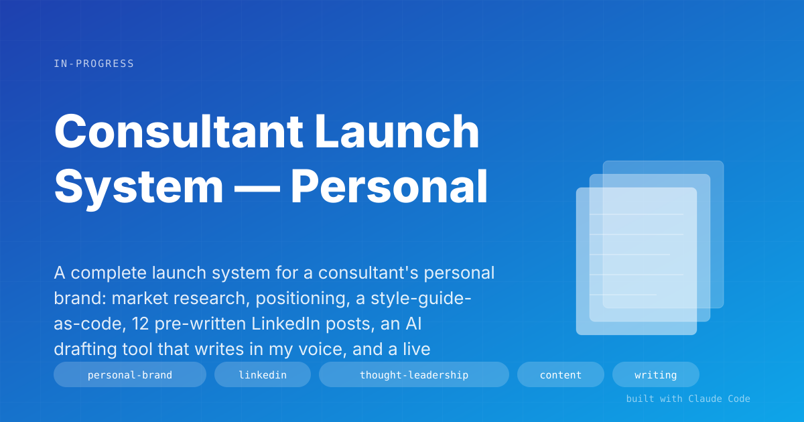
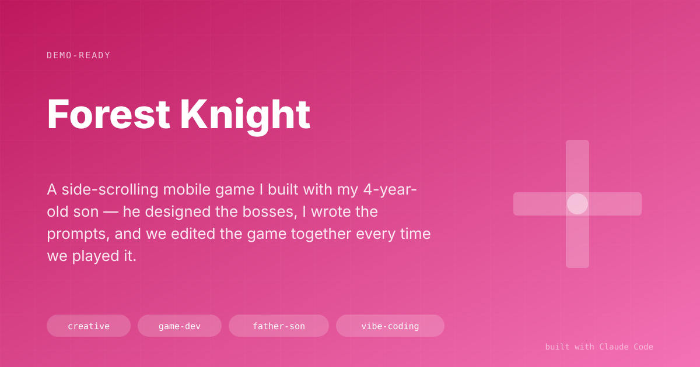
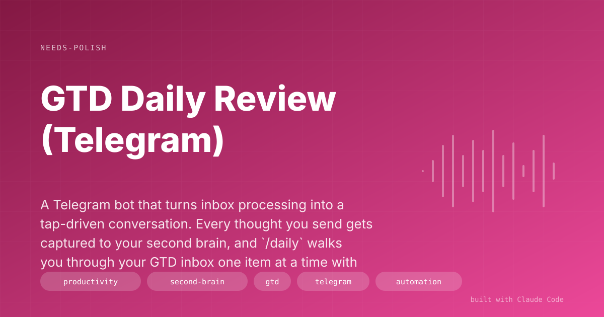
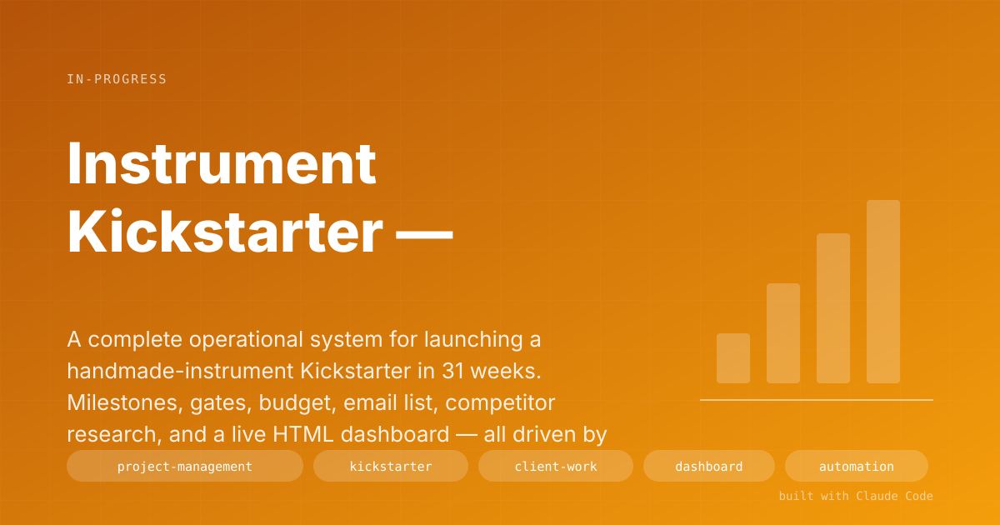
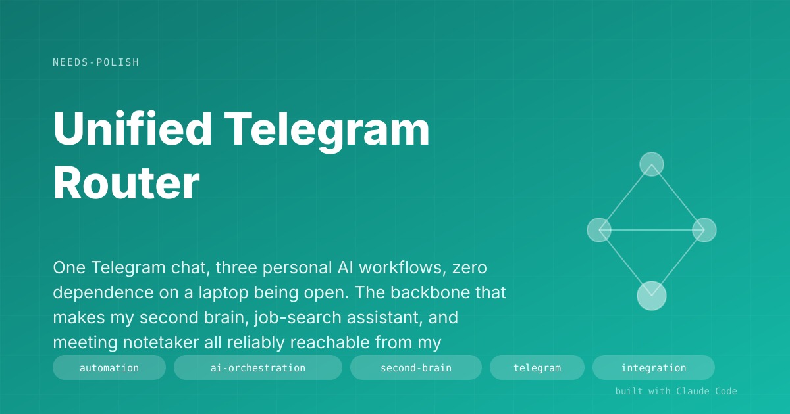
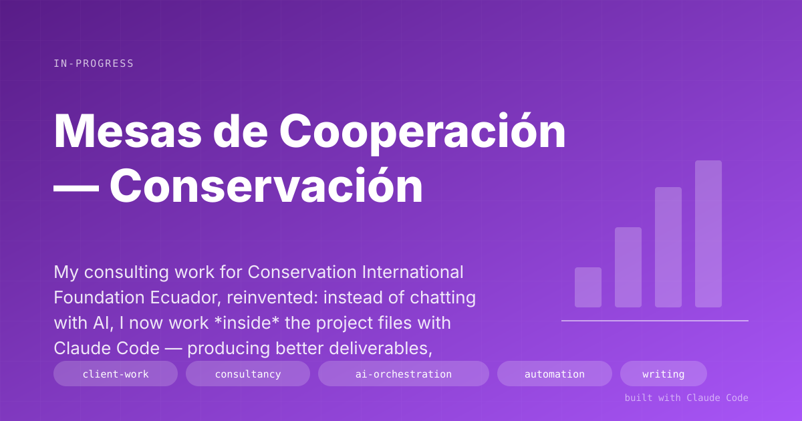
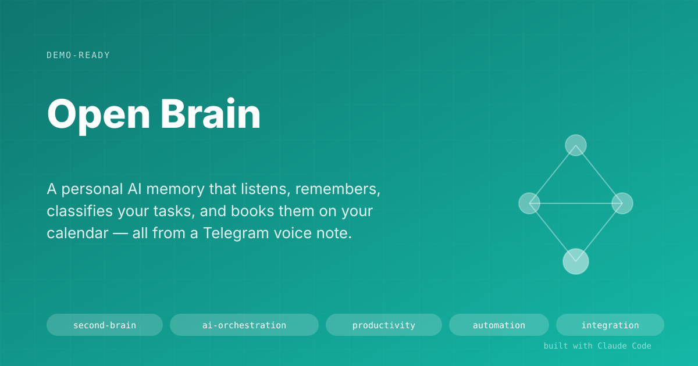
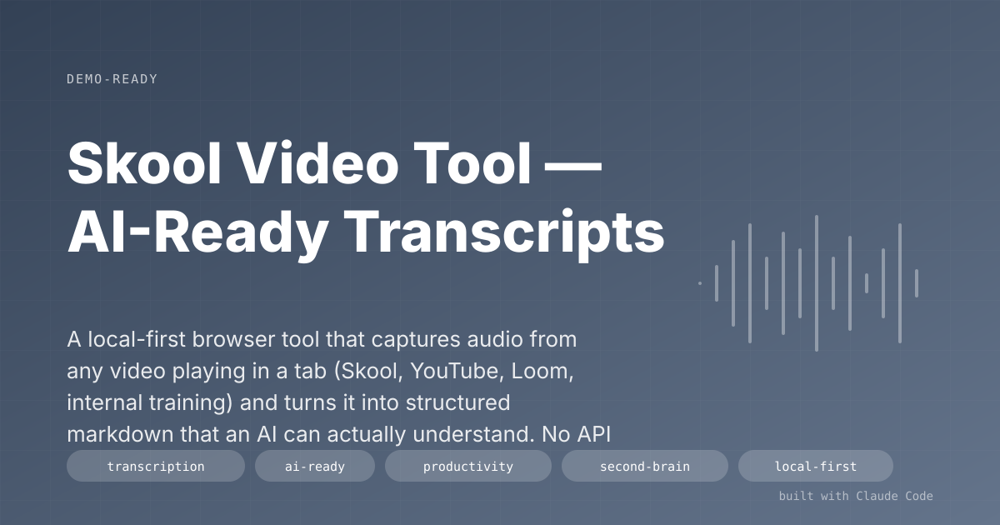
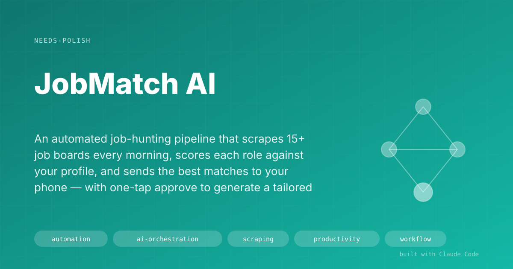

# Agentic Workflows — Portfolio

Personal automation and AI projects built with [Claude Code](https://claude.com/claude-code).
Each one solves a real problem I was running into, built to be reused and demonstrated.

<!-- PORTFOLIO:INDEX:START -->
<!-- Auto-generated. Do not edit between these markers. -->

| | Project | Status |
|---|---|---|
|  | **[Consultant Launch System — Personal Brand & LinkedIn Thought Leadership](projects/consultant-launch-system.md)**   A complete launch system for a consultant's personal brand: market research, positioning, a style-guide-as-code, 12 pre-written LinkedIn posts, an AI drafting tool that writes in my voice, and a live hub of 10 free interactive tools grounded in my real field work. Built to go from zero to income in 60 days.    `personal-brand` · `linkedin` · `thought-leadership` · `content` · `writing` · `ai-orchestration` · `research`   Built in ~3 weeks (ongoing) | `in-progress` |
|  | **[Forest Knight](projects/forest-knight.md)**   A side-scrolling mobile game I built with my 4-year-old son — he designed the bosses, I wrote the prompts, and we edited the game together every time we played it.    `creative` · `game-dev` · `father-son` · `vibe-coding`   Built in ~20 min build + days of play-and-edit | `demo-ready` |
|  | **[GTD Daily Review (Telegram)](projects/gtd-daily-review.md)**   A Telegram bot that turns inbox processing into a tap-driven conversation. Every thought you send gets captured to your second brain, and `/daily` walks you through your GTD inbox one item at a time with inline buttons.    `productivity` · `second-brain` · `gtd` · `telegram` · `automation` · `voice`   Built in ~1 day | `needs-polish` |
|  | **[Instrument Kickstarter — Project Ops System](projects/instrument-kickstarter-ops.md)**   A complete operational system for launching a handmade-instrument Kickstarter in 31 weeks. Milestones, gates, budget, email list, competitor research, and a live HTML dashboard — all driven by one living context file that gets updated after every weekly meeting.    `project-management` · `kickstarter` · `client-work` · `dashboard` · `automation` · `email` · `ai-orchestration`   Built in ~2 weeks (ongoing through launch) | `in-progress` |
|  | **[Meeting Notetaker](projects/meeting-notetaker.md)**   Automatically joins your video calls, turns every meeting into a clean summary with action items and highlights, and drops the tasks straight into your to-do list.    `automation` · `ai-orchestration` · `meetings` · `productivity` · `second-brain` · `multilingual`   Built in ~2 days | `needs-polish` |
|  | **[Unified Telegram Router](projects/unified-telegram-router.md)**   One Telegram chat, three personal AI workflows, zero dependence on a laptop being open. The backbone that makes my second brain, job-search assistant, and meeting notetaker all reliably reachable from my phone.    `automation` · `ai-orchestration` · `second-brain` · `telegram` · `integration` · `productivity`   Built in ~3 days (4-phase rollout, completed 2026-04-16) | `needs-polish` |
|  | **[Wedding Planner — Public Site + Planning Command Center](projects/wedding-planner.md)**   Two surfaces, one wedding. Guests see a polished RSVP + guestbook site; the couple sees a private dashboard with budget, vendors, critical-path tasks, and a moderation queue. All wired to one Supabase backend.    `wedding` · `full-stack` · `astro` · `supabase` · `ai-orchestration`   Built in ~4 sessions across 2 days | `demo-ready` |
|  | **[Interview Co-Pilot](projects/interview-copilot.md)**   A floating assistant that sits on top of your video call, captures both sides of the conversation in real time, transcribes them live, and — when you click a button — gives you a structured 50-word answer tailored to the question you were just asked and the role you're interviewing for.    `real-time` · `ai-orchestration` · `audio` · `productivity` · `macos`   Built in ~1 week | `demo-ready` |
|  | **[Mesas de Cooperación — Conservación Internacional](projects/mesas-cooperacion-ci.md)**   My consulting work for Conservation International Foundation Ecuador, reinvented: instead of chatting with AI, I now work *inside* the project files with Claude Code — producing better deliverables, dashboards for the Cooperation Tables in Sucumbíos and Orellana, and email automation for the two-year roadmap.    `client-work` · `consultancy` · `ai-orchestration` · `automation` · `writing` · `dashboard`   Built in ~1 month of ongoing co-pilot work | `in-progress` |
|  | **[Open Brain](projects/open-brain.md)**   A personal AI memory that listens, remembers, classifies your tasks, and books them on your calendar — all from a Telegram voice note.    `second-brain` · `ai-orchestration` · `productivity` · `automation` · `integration` · `executive-assistant` · `calendar-automation` · `gtd`   Built in ~3 weeks (ongoing) | `demo-ready` |
|  | **[Skool Video Tool — AI-Ready Transcripts](projects/skool-video-tool.md)**   A local-first browser tool that captures audio from any video playing in a tab (Skool, YouTube, Loom, internal training) and turns it into structured markdown that an AI can actually understand. No API keys. Nothing leaves your machine. Record, transcribe, and hand the output straight to Claude.    `transcription` · `ai-ready` · `productivity` · `second-brain` · `local-first`   Built in ~1 weekend | `demo-ready` |
|  | **[JobMatch AI](projects/jobmatch-ai.md)**   A fully automated job-hunting pipeline that scrapes 25+ boards every morning, scores each role with a bespoke rubric, sends the best matches to your phone, and generates a tailored CV and application package with one Telegram command.    `job-search` · `ai-orchestration` · `document-generation` · `telegram-bot` · `automation`   Built in ~1 month (ongoing) | `in-progress` |
|  | **[MOONSHOT — B2B Export Demand Engine](projects/moonshot-export.md)**   A production-grade demand generation system for a premium Ecuadorian snack exporter. Pulls buyer intent signals from 50+ news feeds, scrapes 6+ trade data sources across 19 countries, enriches and scores leads against 28 weighted factors, runs multi-language email sequences through Smartlead with GDPR-compliant voice rules, tracks deliverability in a real-time dashboard, and includes a React marketing website. Not a script — a trade operation running on code.    `b2b` · `outbound` · `lead-generation` · `automation` · `ai-orchestration` · `scraping` · `compliance` · `dashboard`   Built in ~2 months (ongoing) | `in-progress` |

<!-- PORTFOLIO:INDEX:END -->

---

## How this portfolio works

Each project has its own page in [`projects/`](projects/) with:

- A plain-language problem & solution writeup (no jargon)
- Screenshots of what it actually looks like
- Key decisions and trade-offs
- A demo pitch — what I'd say to show it off

Screenshots and hero images live in [`assets/<slug>/`](assets/).

## About

I build small, focused AI workflows that take friction out of real work —
meetings, notes, admin, research. Each project is designed for its user first,
not as a technical showcase. If one of these looks useful for what you're doing,
reach out.
