# Agentic Workflows Portfolio

Automation and AI projects I built with [Claude Code](https://claude.com/claude-code), and the consulting work they grew out of.
Each system solves a real problem from my work or my family's life, and each page explains it in plain language.

Last updated: 28 September 2026.

<!-- PORTFOLIO:INDEX:START -->
<!-- Auto-generated by tools/build_portfolio.py. Do not edit between these markers. -->

### Systems and builds (17)

| | Project | Status |
|---|---|---|
| [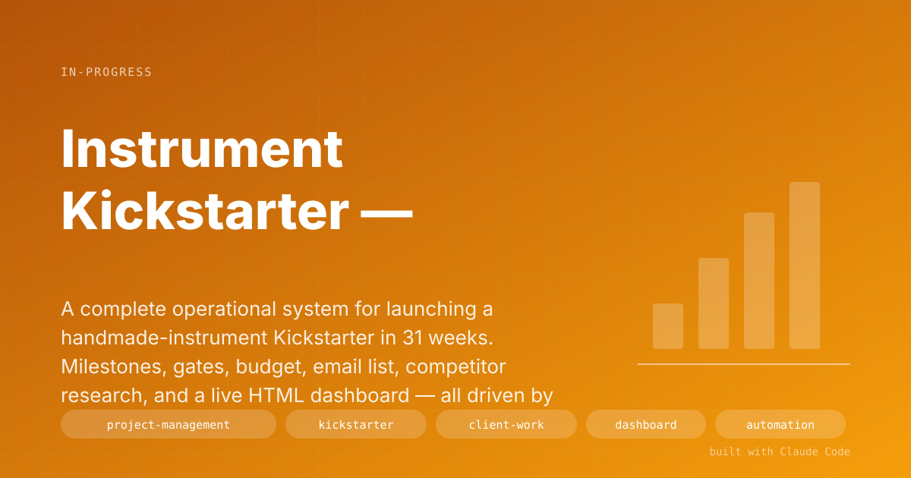](projects/instrument-kickstarter-ops.md) | **[Instrument Kickstarter. Project Ops System](projects/instrument-kickstarter-ops.md)** <br> A complete operational system for launching a handmade-instrument Kickstarter in 31 weeks. Milestones, gates, budget, email list, competitor research, and a live HTML dashboard, all driven by one living context file that gets updated after every weekly meeting. <br><br> `project-management` · `kickstarter` · `client-work` · `dashboard` · `automation` · `email` · `ai-orchestration` <br> Built in ~2 weeks to build, then weekly updates April to July 2026 | `in-progress` |
| [](projects/jobmatch-ai.md) | **[JobMatch AI](projects/jobmatch-ai.md)** <br> A job and consultancy-tender pipeline that reads 43 sources and 104 employer career pages every morning, scores each posting against my record, sends the best 25 to my phone, and prepares a tailored CV on one Telegram command. It has logged over 30,000 postings since August 2026. <br><br> `job-search` · `ai-orchestration` · `scraping` · `local-llm` · `telegram-bot` · `automation` <br> Built in ~7 months (ongoing since February 2026) | `in-progress` |
| [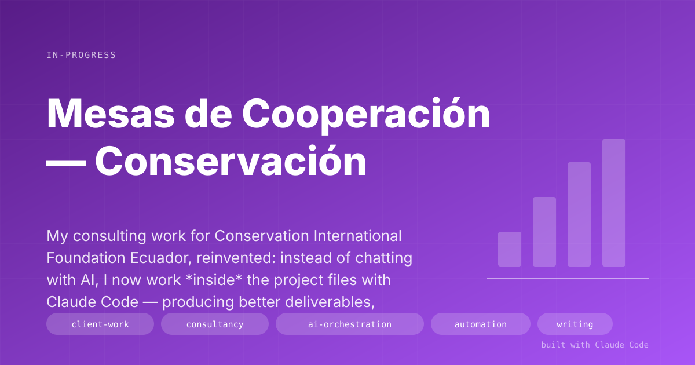](projects/mesas-cooperacion-ci.md) | **[Mesas de Cooperación. Conservación Internacional](projects/mesas-cooperacion-ci.md)** <br> My consulting work for Conservation International Foundation Ecuador, reinvented: instead of chatting with AI, I now work *inside* the project files with Claude Code: producing better deliverables, dashboards for the Cooperation Tables in Sucumbíos and Orellana, and email automation for the two-year roadmap. <br><br> `client-work` · `consultancy` · `ai-orchestration` · `automation` · `writing` · `dashboard` <br> Built in ~2 months (March to May 2026) | `in-progress` |
| [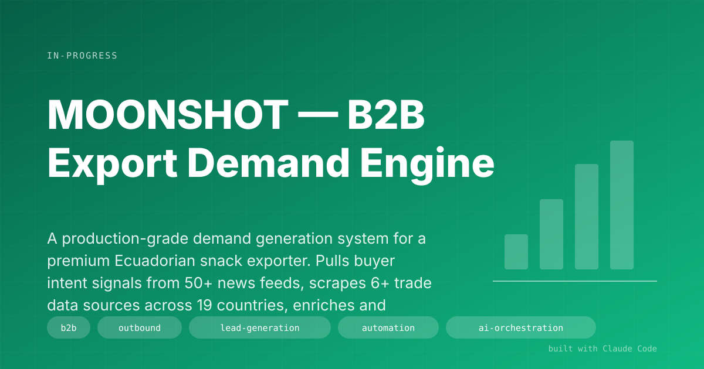](projects/moonshot-export.md) | **[MOONSHOT. B2B Export Demand Engine](projects/moonshot-export.md)** <br> A production-grade demand generation system for a premium Ecuadorian snack exporter. Pulls buyer intent signals from 50+ news feeds, scrapes 6+ trade data sources across 19 countries, enriches and scores leads against 28 weighted factors, runs multi-language email sequences through Smartlead with GDPR-compliant voice rules, tracks deliverability in a real-time dashboard, and includes a React marketing website. Since June it also runs the reply-to-deal follow-up, first-party open tracking, and a bookkeeping engine that matches eight months of spending against tax-authority invoices. <br><br> `b2b` · `outbound` · `lead-generation` · `automation` · `finance-ops` · `scraping` · `compliance` · `dashboard` · `export` <br> Built in ~7 months (ongoing since February 2026) | `in-progress` |
| [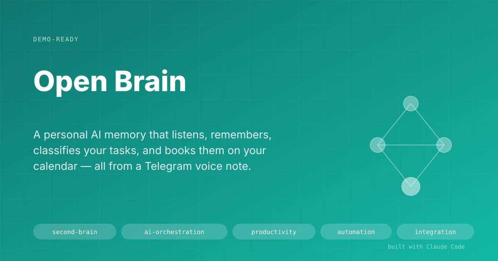](projects/open-brain.md) | **[Open Brain](projects/open-brain.md)** <br> A personal AI memory that listens, remembers, classifies your tasks, and books them on your calendar, all from a Telegram voice note. <br><br> `second-brain` · `ai-orchestration` · `productivity` · `automation` · `integration` · `executive-assistant` · `calendar-automation` · `gtd` <br> Built in ~2 months of active building (March to May 2026), maintained since | `demo-ready` |
| [](projects/preparatoria-en-casa.md) | **[Preparatoria en Casa. A Homeschool Year Checked Against the National Curriculum](projects/preparatoria-en-casa.md)** <br> A full school year for my five-year-old son, taught at home in Quito and mapped week by week to Ecuador's official curriculum, with a script that proves all 151 required skills are covered. <br><br> `education` · `curriculum` · `family` · `verification` · `research-library` <br> Built in August 2026, before the school year started | `demo-ready` |
| [](projects/jdv-tradeadvisor.md) | **[JDV TradeAdvisor. Export and Import Guides for Small Ecuadorian Firms](projects/jdv-tradeadvisor.md)** <br> Plain-Spanish trade guides for small Ecuadorian companies: a first-shipment export checklist for a snack maker selling to the UAE, a one-day training offer so its team can export without an agent, and an import business case for electronic parts from China. <br><br> `trade` · `export` · `import` · `client-work` · `one-pagers` · `spanish` <br> Built in 2 to 3 sessions per deliverable | `demo-ready` |
| [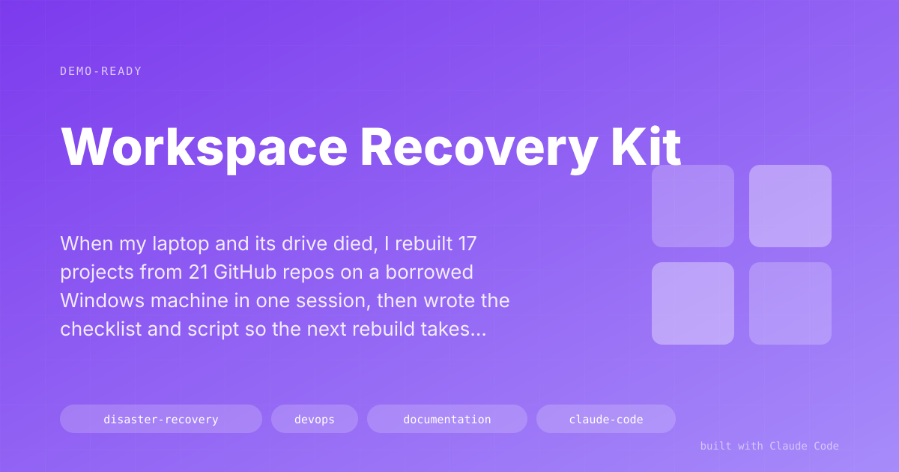](projects/workspace-recovery-kit.md) | **[Workspace Recovery Kit](projects/workspace-recovery-kit.md)** <br> When my laptop and its drive died, I rebuilt 17 projects from 21 GitHub repos on a borrowed Windows machine in one session, then wrote the checklist and script so the next rebuild takes minutes. <br><br> `disaster-recovery` · `devops` · `documentation` · `claude-code` <br> Built in 1 session | `demo-ready` |
| [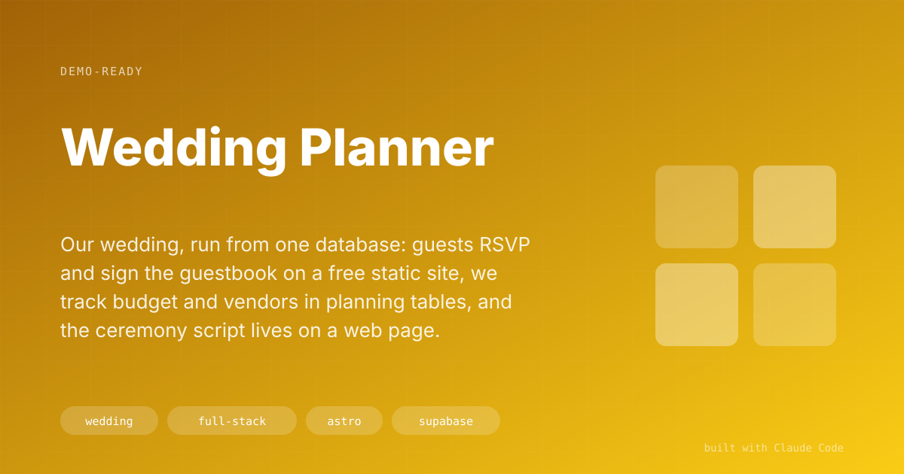](projects/wedding-planner.md) | **[Wedding Planner. Public Site, Planning Backend and Ceremony Script](projects/wedding-planner.md)** <br> Our wedding, run from one database: guests RSVP and sign the guestbook on a free static site, we track budget and vendors in planning tables, and the ceremony script lives on a web page. <br><br> `wedding` · `full-stack` · `astro` · `supabase` · `ai-orchestration` <br> Built in ~4 sessions across 2 days, plus a ceremony script in June | `demo-ready` |
| [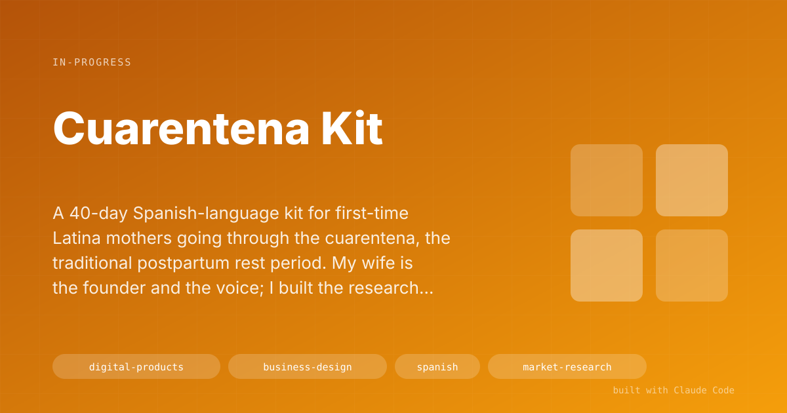](projects/cuarentena-postpartum-kit.md) | **[Cuarentena Kit. A Spanish Digital Product Business, Built as a Couple](projects/cuarentena-postpartum-kit.md)** <br> A 40-day Spanish-language kit for first-time Latina mothers going through the cuarentena, the traditional postpartum rest period. My wife is the founder and the voice; I built the research, the offer and the tools behind it. <br><br> `digital-products` · `business-design` · `spanish` · `market-research` · `content` <br> Built in ~1 week of planning sessions (launch pending) | `in-progress` |
| [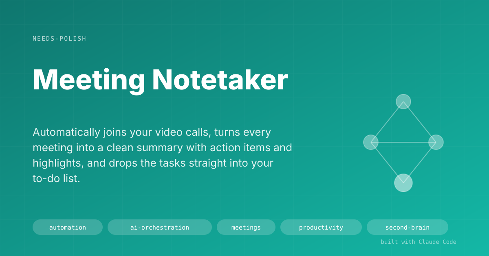](projects/meeting-notetaker.md) | **[Meeting Notetaker](projects/meeting-notetaker.md)** <br> Automatically joins your video calls, turns every meeting into a clean summary with action items and highlights, and drops the tasks straight into your to-do list. <br><br> `automation` · `ai-orchestration` · `meetings` · `productivity` · `second-brain` · `multilingual` <br> Built in ~2 days | `needs-polish` |
| [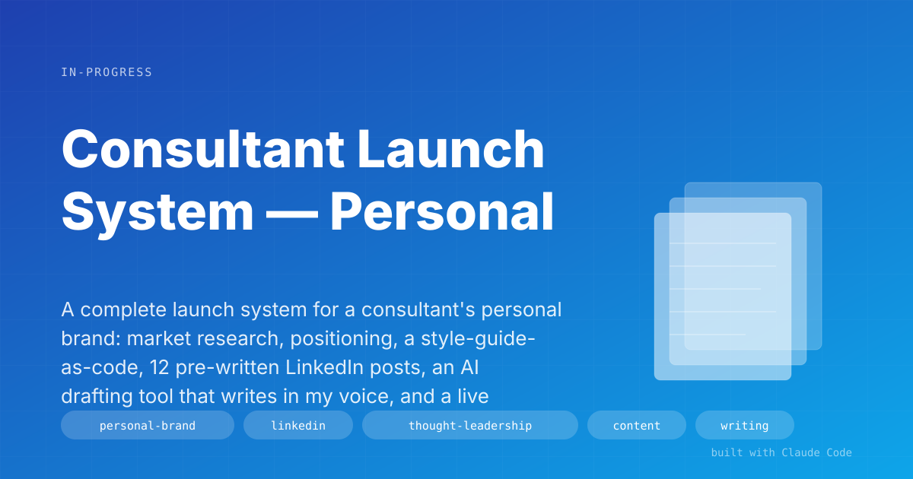](projects/consultant-launch-system.md) | **[Consultant Launch System. Personal Brand & LinkedIn Thought Leadership](projects/consultant-launch-system.md)** <br> A complete launch system for a consultant's personal brand: market research, positioning, a style-guide-as-code, 12 pre-written LinkedIn posts, an AI drafting tool that writes in my voice, and a live hub of 10 free interactive tools grounded in my real field work. Built to go from zero to income in 60 days. <br><br> `personal-brand` · `linkedin` · `thought-leadership` · `content` · `writing` · `ai-orchestration` · `research` <br> Built in ~3 weeks (ongoing) | `in-progress` |
| [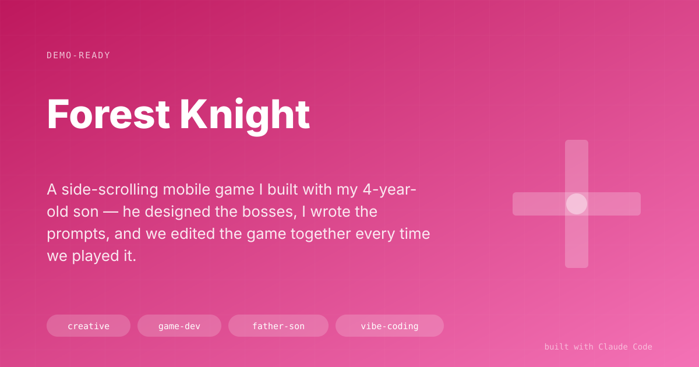](projects/forest-knight.md) | **[Forest Knight](projects/forest-knight.md)** <br> A side-scrolling mobile game I built with my 4-year-old son: he designed the bosses, I wrote the prompts, and we edited the game together every time we played it. <br><br> `creative` · `game-dev` · `father-son` · `vibe-coding` <br> Built in ~20 min build + days of play-and-edit | `demo-ready` |
| [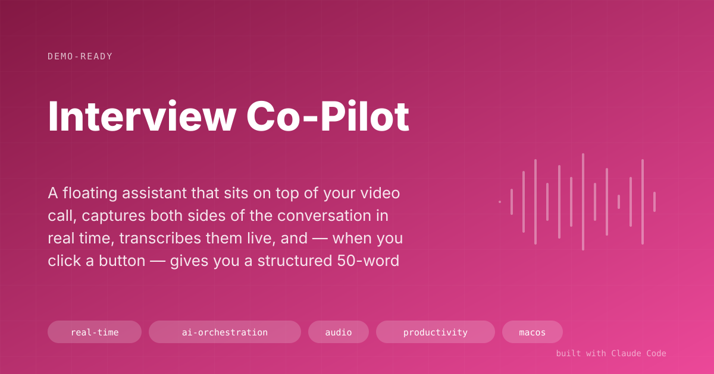](projects/interview-copilot.md) | **[Interview Co-Pilot](projects/interview-copilot.md)** <br> A floating assistant that sits on top of your video call, captures both sides of the conversation in real time, transcribes them live, and, when you click a button, gives you a structured 50-word answer tailored to the question you were just asked and the role you're interviewing for. <br><br> `real-time` · `ai-orchestration` · `audio` · `productivity` · `macos` <br> Built in ~1 week | `demo-ready` |
| [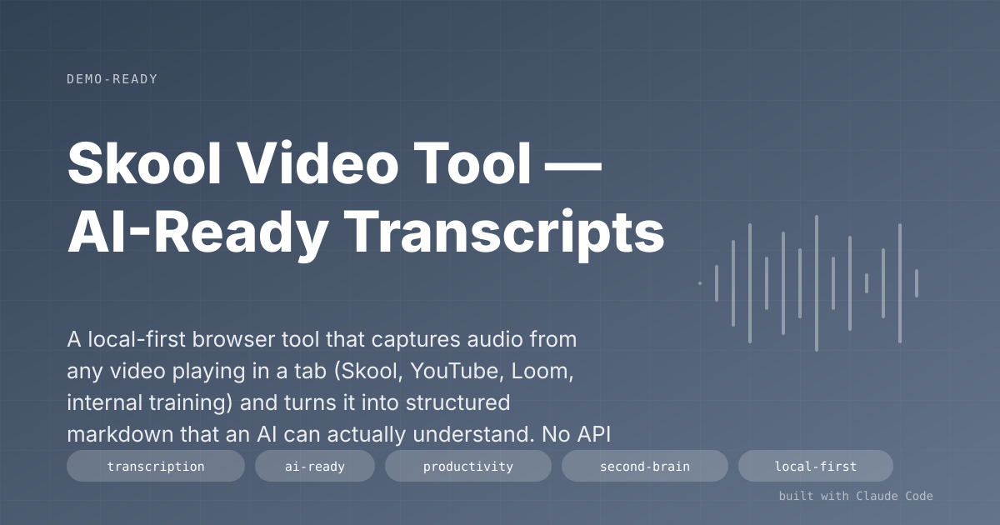](projects/skool-video-tool.md) | **[Skool Video Tool. AI-Ready Transcripts](projects/skool-video-tool.md)** <br> A local-first browser tool that captures audio from any video playing in a tab (Skool, YouTube, Loom, internal training) and turns it into structured markdown that an AI can actually understand. No API keys. Nothing leaves your machine. Record, transcribe, and hand the output straight to Claude. <br><br> `transcription` · `ai-ready` · `productivity` · `second-brain` · `local-first` <br> Built in ~1 weekend | `demo-ready` |
| [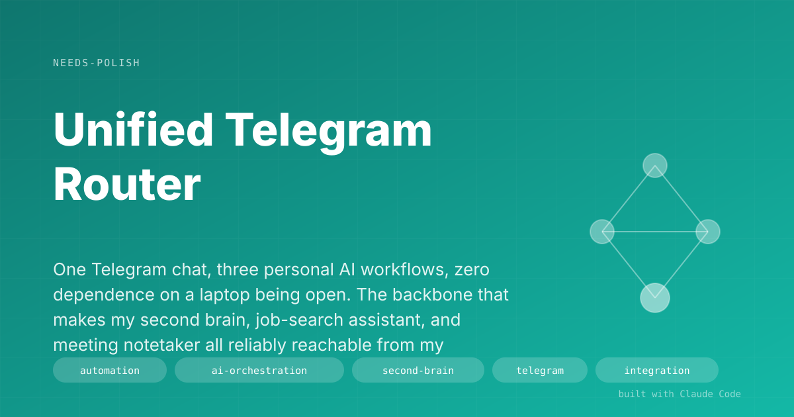](projects/unified-telegram-router.md) | **[Unified Telegram Router](projects/unified-telegram-router.md)** <br> One Telegram chat, three personal AI workflows, zero dependence on a laptop being open. The backbone that makes my second brain, job-search assistant, and meeting notetaker all reliably reachable from my phone. <br><br> `automation` · `ai-orchestration` · `second-brain` · `telegram` · `integration` · `productivity` <br> Built in ~3 days (4-phase rollout, completed 2026-04-16) | `needs-polish` |
| [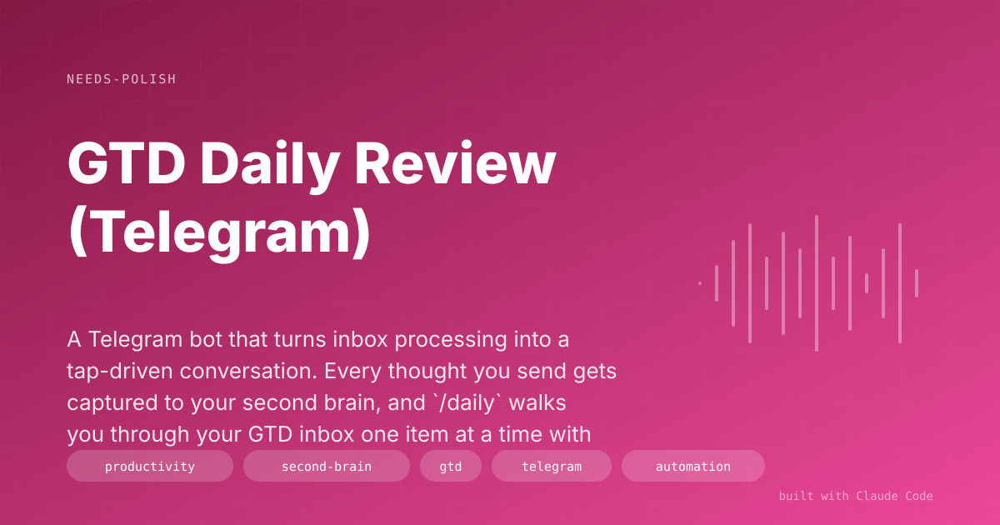](projects/gtd-daily-review.md) | **[GTD Daily Review (Telegram)](projects/gtd-daily-review.md)** <br> A Telegram bot that turns inbox processing into a tap-driven conversation. Every thought you send gets captured to your second brain, and `/daily` walks you through your GTD inbox one item at a time with inline buttons. <br><br> `productivity` · `second-brain` · `gtd` · `telegram` · `automation` · `voice` <br> Built in ~1 day | `needs-polish` |

### Consulting engagements (6)

The field work the systems above grew out of.

| Engagement | What I did | Since |
|---|---|---|
| **[Amazon Andes Fund. IMPAQTO Capital](projects/impaqto-amazon-andes-fund.md)** | Research consultant on Phase Zero of the Amazon Andes Fund, IMPAQTO Capital's impact-investing vehicle backing processors, exporters, and ingredient companies across the Amazon and Andes. | 2026 |
| **[NEXT Ecuador. ITC (UN/WTO) and the EU](projects/itc-next-ecuador.md)** | Senior consultant on export readiness for NEXT Ecuador, the EU-funded program executed by the International Trade Centre (ITC, UN/WTO): trained around 250 producers across three provinces. | 2025 |
| **[International Cooperation Office. Morona Santiago](projects/morona-santiago-cooperation-office.md)** | Chief of the International Cooperation Office for the Provincial Government of Morona Santiago: stood up the province's first cooperation table of 22+ organizations and led the provincial counterpart to a $1M bioeconomy project. | 2024 |
| **[Sacred Headwaters Alliance](projects/sacred-headwaters-alliance.md)** | Binational Indigenous strategic alignment for the Sacred Headwaters Alliance: coordination across around 30 nations and 35 million hectares of rainforest in Ecuador and Peru. | 2023 |
| **[National Carbon Baseline and Galápagos Standards. CEELA](projects/ceela-maate-baselines.md)** | Sustainability and energy consultant with CEELA and Ecuador's Ministry of Environment: co-authored the national construction-sector carbon baseline with 40 NDC-aligned policy recommendations, and co-developed the first sustainable-construction standards for the Galápagos. | 2022 |
| **[Fundación IKIAM. Achuar Nation](projects/fundacion-ikiam-achuar.md)** | Executive Director of Fundación IKIAM for the Achuar Nation of Ecuador: ran the full grant cycle and raised over $70K for food sovereignty and territorial protection. | 2020 |

<!-- PORTFOLIO:INDEX:END -->

---

## How this portfolio works

Each project has its own page in [`projects/`](projects/) with:

- A plain-language problem and solution writeup
- Key decisions and trade-offs
- A demo pitch: what I'd say to show it off

Hero images live in [`assets/<slug>/`](assets/).

The index above is generated from each page's frontmatter. After adding or editing a page, run:

```bash
python tools/build_portfolio.py          # rebuild the index and any missing hero cards
python tools/build_portfolio.py --check  # exit 1 if anything is out of date
```

## About

I build small, focused AI workflows that take friction out of real work:
meetings, notes, admin, research, trade paperwork. Each project is designed for its user first,
not as a technical showcase. If one of these looks useful for what you're doing,
reach out.
