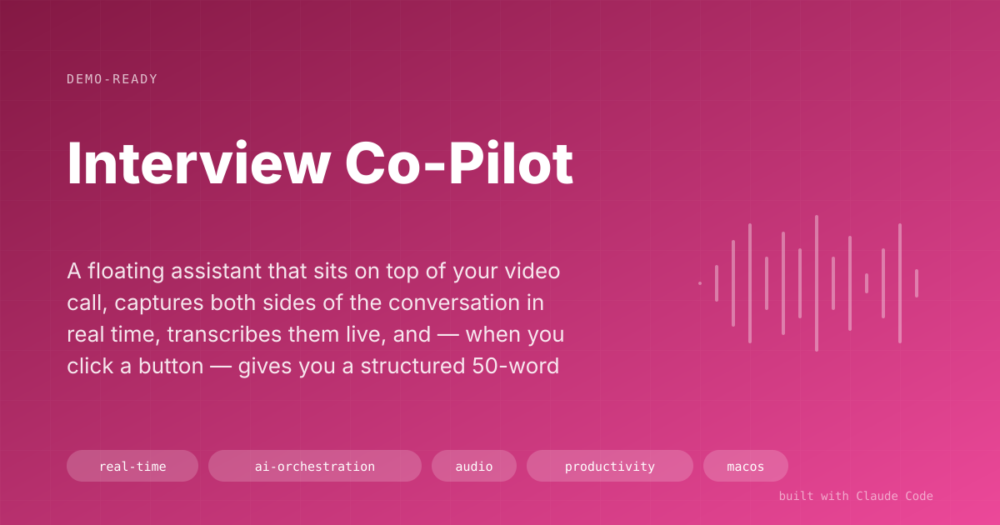

# Interview Co-Pilot

> A floating assistant that sits on top of your video call, captures both sides of the conversation in real time, transcribes them live, and — when you click a button — gives you a structured 50-word answer tailored to the question you were just asked and the role you're interviewing for.

## The Problem
Job interviews are high-stakes and high-latency. You hear a question, your brain blanks for two seconds, and you either stumble or fall back on a rehearsed answer that doesn't quite fit. Interview prep documents help, but you can't read a 10-page prep file in real time while an interviewer is waiting for you to answer. I wanted something that reads the room with me — *literally* — and surfaces the right talking points when I'm stuck.

## The Solution
A small floating window that runs alongside Zoom. During the call:

1. **Captures two audio streams simultaneously** — the interviewer (via a macOS virtual audio driver called BlackHole) and your microphone — at 16kHz, chunked into 5-second windows with voice activity detection so silence isn't sent to the API.
2. **Transcribes live** using OpenAI Whisper. The transcript updates in the window as the conversation happens — interviewer lines in blue, yours in green.
3. **Filters Whisper hallucinations** with a curated blocklist of 30+ common artifacts ("thanks for watching", "subtitles by…") that Whisper emits on silent chunks.
4. **Generates a tactical answer on demand** — click "How to Respond?" and Claude Haiku produces a structured 50-word response (🎯 opening → key points → 🚀 closing) using the last 15–20 minutes of transcript plus your interview prep file.
5. **Auto-detects language mid-call** — switches between English and Spanish based on keyword heuristics.
6. **Saves the full transcript** as markdown with speaker attribution for post-call review.

Per-interview cost: about **$1** (Whisper ≈$0.27 + ~10 Claude responses ≈$0.05–0.10).

## Screenshots

*The window stays above the Zoom call — dual-pane with live transcript on top and AI response on the bottom.*

*50-word structured answer on demand — opening, key points, closing. Read it, adapt in your own words, don't parrot.*

## Result
- **Real-time transcription + on-demand coaching** during live calls, all for ~$1 per interview.
- **Two study deliverables per interview** generated up front by a companion skill: a Parakeet-format tactical copilot markdown for in-call reference, and a study-guide markdown for deep prep via NotebookLM.
- **Stealth-mode** (v2) makes the window invisible to screen recording (macOS `NSWindowSharingNone`), so it's safe on interviews where screen-share is active.
- **Coaching engine** (v2) detects STAR-question patterns in the transcript, counts hedge words you're using, and flags prep points you haven't covered yet.
- Cost vs. commercial copilots: a fraction. A human interview coach is $200–500 per session; this is built once and reused forever.

## Key Decisions
- **Physical audio routing, not post-hoc separation.** BlackHole + a macOS multi-output device gives a clean stream for the interviewer and a separate stream for my mic. No speaker-diarization model required.
- **5-second chunks with VAD.** Long enough to transcribe meaningfully, short enough to keep perceived latency under 3 seconds. Voice activity detection drops silent chunks so Whisper doesn't invent words.
- **Hallucination blocklist as a first-class concern.** Whisper is brilliant but will emit "thanks for watching" on a silent chunk if you let it. The blocklist catches those before they pollute the transcript that Claude sees.
- **Trim the transcript before generation.** The model sees the last ~4,000 words / 15–20 minutes, not the whole call. Keeps latency low and keeps the model focused on the current thread.
- **Dual-model mode (v2): Haiku for speed, Sonnet for depth.** Haiku answers in ~2s for fast follow-ups; Sonnet is used when you want a more careful answer.
- **Never parrot.** The output is a scaffold (opening / key points / closing), not a script. Reading verbatim from the screen is the fastest way to sound hollow.
- **Stealth window.** `NSWindowSharingNone` on the UI window is the difference between "this is a helpful copilot" and "this is a screen-sharing disaster."

## Under the Hood
**Stack:** Python 3, PyQt6 (floating always-on-top window), `sounddevice` + `soundfile` for audio I/O, OpenAI Whisper-1 for transcription, Anthropic SDK (Claude Haiku 4.5 default, Sonnet fallback), BlackHole + switchaudio-osx for macOS audio routing.

Three versions in the folder: **v1** is the minimum viable copilot; **v2** adds config presets (Concise/Detailed/STAR formats), stealth mode, the coaching engine, auto audio switching, and the dual-model option; **v3** contains design-phase UI work. A companion skill (`interview-copilot` under `~/.claude/skills/`) generates the per-interview prep docs (tactical copilot + NotebookLM study guide) before the call.

## How to Demo It
1. Open Zoom and join any call with a second device (or play a YouTube interview as the "interviewer").
2. Launch the copilot: `python tools/ui_app.py` — floating window appears on top.
3. Point at a context file (company, role, STAR stories, salary expectations).
4. Click "Start Recording." Show the live dual-color transcript as both sides speak.
5. At a natural "tell me about a time when…" moment, click "How to Respond?" — watch the 50-word structured answer stream in within 2–3 seconds.
6. Mention the stealth mode: screen-share won't capture the window.

## Limitations & Setup
- **macOS only** — the audio routing depends on BlackHole and `switchaudio-osx`. Linux/Windows would need equivalents.
- Requires `OPENAI_API_KEY` and `ANTHROPIC_API_KEY`.
- First-time setup: install BlackHole, create a multi-output device in Audio MIDI Setup, route Zoom input to it.
- Whisper latency floor is ~5s (chunk length). This is not a zero-latency real-time transcription system — it's near-real-time.
- The AI answers are scaffolds. Reading them verbatim is a bad idea; adapt them in your own words.

## Demo Pitch
> "It's a floating window that listens to both sides of a Zoom interview, transcribes live, and when you click a button, gives you a 50-word scaffold for your next answer — opening, key points, closing — based on the question you just heard and the prep file you gave it. Total cost: about a dollar per interview. The alternative is a human interview coach at $200 a session."
