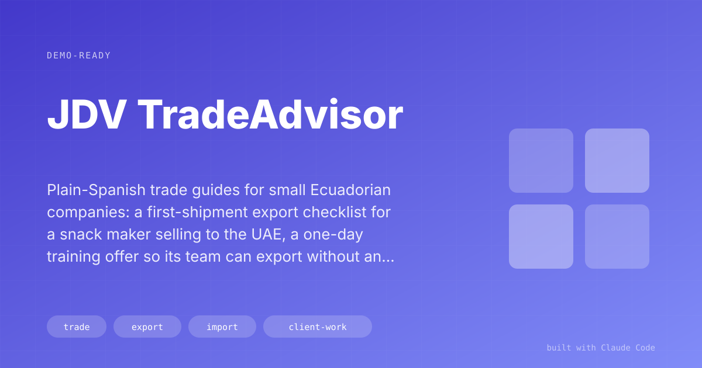

# JDV TradeAdvisor

> Plain-Spanish trade guides for small Ecuadorian companies: a first-shipment export checklist for a snack maker selling to the UAE, a one-day training offer so its team can export without an agent, and an import business case for electronic parts from China.

## The Problem

Small Ecuadorian firms that land their first foreign buyer usually hand the paperwork to a customs agent and hope. The rules live in ECUAPASS (Ecuador's customs portal), in tariff schedules and in the agent's head. When one document is wrong, the container sits in the destination port and the exporter pays detention for every day it does not move.

What these owners need is a list of what to do next, in their own words and with their own products.

## The Solution

Each deliverable is a single web page on GitHub Pages, written for the owner, in Spanish, with their own products and dates. Three so far:

1. **Export guide, Mazal (Snackville S.A.) to the United Arab Emirates.** The company's situation in four lines, everything they need to do in ECUAPASS, and a dated plan to the shipping deadline. It comes with a bilingual packing-list template in Excel, palletized and with tariff codes.
2. **"Mazal exporta sola" training proposal.** A one-day session at the plant for three or four staff. By the end, the team can register products and issue the certificate of origin in ECUAPASS, file and close the export declaration (DAE) within its 30-day window, and produce an invoice and packing list that match each other and the DAE. Every exercise uses the company's real shipment.
3. **Electronic-parts import plan.** A business case for a firm that already supplies 10 to 15 electronics shops and wants to import robotics parts from China. It compares a small courier test shipment with a full company import, shows where each sales dollar goes, and recommends the order to do them in.

## Result

- **One shipment's paperwork on one page.** The Mazal guide covers the four failure points that most often hold a container: documents that do not match, wrong tariff codes (candied almonds and roasted almonds sit under different headings, 1704.90 and 2008.19), a late certificate of origin, and a DAE left open past 30 days.
- **An offer built to end the dependency on outside help.** The training's stated result is that the next export goes out without calling us or paying an agent.
- **A yes/no answer on the import idea.** The plan estimates a gross margin of about 57% on sales, and names capital as the limit on growth. The recommendation is a small test first, then company imports once quality and lead times check out.

## Key Decisions

**One page per client, published as a link.** A link opens on any phone and always shows the latest version. Each page is a static HTML file on GitHub Pages, so it costs nothing to host and updates in minutes.

**Their case, never a generic one.** Every example uses the client's own products, buyer, freight agent and deadline. A generic export manual already exists and nobody reads it.

**The answer comes first.** The import plan opens with "Sí deja plata" (yes, it makes money) and four numbers before any process.

**Estimates are labelled as estimates.** The import plan says on its first screen that its numbers will be refined with real supplier quotes.

## Under the Hood

**Stack:** Hand-written HTML and CSS with light and dark themes, GitHub Pages, an Excel packing-list template.

The Mazal kickoff call was transcribed and kept next to the deliverables, so the guide and the proposal are written from what the client said on the call.

## How to Demo It

1. Open the Mazal export guide on a phone. Scroll the four-line summary and the ECUAPASS section.
2. Open the packing-list template and show the tariff codes and pallet layout.
3. Open the training proposal and read the four risk points and what the team can do at the end of the day.
4. Open the import plan and show the two options side by side, with the profit band.

## Limitations & Setup

- Written in Spanish, for Ecuador's customs system.
- Figures in the import plan are estimates made before supplier quotes.
- The training date is still to be confirmed with the client.

## Demo Pitch

> "When a small exporter lands their first foreign buyer, I give them one page in plain Spanish with their products, their deadline and every ECUAPASS step. Then I offer a day at their plant so their own team can do it next time without an agent."
