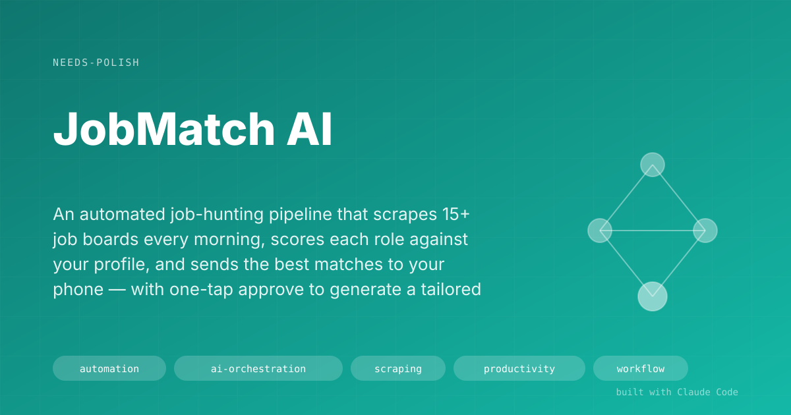

# JobMatch AI

> A job and consultancy-tender pipeline that reads 43 sources and 104 employer career pages every morning, scores each posting against my record, sends the best 25 to my phone, and prepares a tailored CV on one Telegram command. It has logged over 30,000 postings since August 2026.

## The Problem

Job hunting in international development and conservation means checking 25+ fragmented sources daily: UN Careers, ReliefWeb, ImpactPool, ClimateBASE, procurement feeds, conservation boards, direct org sites. Each has its own interface and alert system. A good role might appear on four boards, or only one obscure one.

What I was doing before: 2–3 hours every morning scanning boards, reading descriptions, deciding what was worth pursuing. Then another 1–2 hours per application tailoring a CV. The noise was crushing, the hit rate was low, and I still missed things.

## The Solution

JobMatch AI runs a two-phase automated pipeline: Phase 1 every morning at 5am without touching the laptop, Phase 2 on-demand the moment I approve a job from my phone.

### Phase 1: Discovery (runs while I sleep)

1. **Scrape.** Scrapers for 43 sources pull new listings: ImpactPool, DevNetJobs, ReliefWeb, ClimateBASE, UNGM and UNDP procurement, UN Talent, DevelopmentAid, PCDN, Conservation Job Board, LinkedIn email alerts and more, plus 104 target employers read from their own career pages.
2. **Deduplicate.** Cross-source dedup catches the same role posted on multiple boards, so I never see it twice.
3. **Pre-filter.** Hard rules drop obvious mismatches before the expensive scoring step: wrong seniority, wrong geography, salary floor violations.
4. **Score.** A 0 to 100 rubric. Deterministic eligibility rules run first; a model then judges fit (see "What Changed Since April 2026" for the provider chain). Final score = HOT (85+), WARM (60–84), COLD, or SKIP. The original design, still in the code for when a key is set, runs Haiku on every job and Sonnet on the borderline 45 to 72 range.
5. **Route.** Deterministic logic assigns an action plan: `INSPIRA_PDF` (UN jobs), `EMAIL_FULL`, `EMAIL_CV_ONLY`, `PORTAL_UPLOAD`, or `MANUAL_REVIEW`. Zero AI in this step: rules based on org type and application requirements extracted during scoring.
6. **Notify.** Telegram HOT alert immediately for ≥85 scores. A daily digest of up to 25 postings, each with deadline countdown and the action plan already decided.

### Phase 2: Application (on-demand, triggered by one Telegram command)

When I type `approve 75831` on my phone:

1. Scrapes the organization's context (website, about page) for CV personalization.
2. Generates a tailored CV in JSON using Sonnet: mirrors exact JD vocabulary, includes a gap acknowledgment if I'm missing a stated requirement (e.g., "I hold a BSc in Engineering, not an MSc in IR, but I've led governance tables across 3 Amazonian provinces…"), bold-highlights ATS keywords.
3. Assembles DOCX via template engine.
4. Runs Haiku hallucination check: cross-references every metric and credential in the CV against my profile. If it invented something, flags it for review instead of staging.
5. For UN Inspira jobs: generates an offline PDF template + a pre-filled cheatsheet (salary history, supervisor contacts, education dates, languages, publications, certifications): turns a 3-hour Inspira form-filling session into 20 minutes.
6. Creates a Gmail draft ready to send (for email-apply jobs).
7. Creates a GTD next-action task + schedules a 60-minute calendar block automatically, computed from the job's deadline.
8. Sends me a Telegram confirmation with file paths and the next step.

## What Changed Since April 2026

My laptop died on 21 July 2026 (see [Workspace Recovery Kit](workspace-recovery-kit.md)). The pipeline came back on a Windows machine with no API keys, and it had to keep running every morning while it was rebuilt. The rebuild changed the system more than the first month of building it.

**Scoring moved off the paid API.** A provider chain now tries a local model first (Qwen3-Coder 30B through Ollama, free, on the CPU), then OpenRouter, then Anthropic when a key exists. Batches the local model cannot handle well get read inside a Claude Code session. Of the 24,079 verdicts in the current database, 8,076 came from the local model, 3,512 from OpenRouter, 1,976 from Claude Code sessions, and the rest from rules written in code.

**Hard rules moved into code.** Tested on the full rubric, the local model ranked a job that required recent Philippines experience above the best-matching job in the pipeline, and never applied the geography rule. So the disqualifiers (geography, eligibility, link patterns, seniority) now run as deterministic Python before any model sees the job, and the model is asked only for the judgement part.

**Consultancy tenders sit next to jobs.** UN procurement portals (UNGM and UNDP procurement), DevelopmentAid consulting and others now feed a separate consultancy track, scored for team bids: 60% personal fit is strong when a partner can cover the rest. 3,095 of the stored postings are tenders.

**More sources, read more carefully.** 43 sources in the database (up from 25+), plus 104 target employers read directly from their career pages. ReliefWeb is now read page by page instead of through its RSS feed, which had been missing postings. Thin listings get their full text fetched before the filter judges them, so a short summary no longer buries a good job.

**The morning digest is capped at 25.** A per-job ledger records what was sent, so nothing repeats and postings the server reports as closed do not use up a slot. Duplicates are caught across two URLs for one posting and across two portals for one tender.

**Alerts that can be trusted.** A watchdog runs at 08:00 and alerts if the 05:00 run did not happen. A `doctor` command reports stale queues and dead scrapers. One health alert was rewritten three times: it named working scrapers dead, it named permanently blocked scrapers dead every morning, and it asked for a scorer that had never run to be recalibrated. An alert that is always wrong teaches you to stop reading it.

**Windows scheduling.** Task Scheduler replaced macOS launchd.

## Screenshots

<!-- broken image dropped at build time (PNG never created):  -->*Daily digest on Telegram: score, org, deadline countdown, action plan, all decided before I see it.*

<!-- broken image dropped at build time (PNG never created):  -->*Pipeline dashboard: score distribution, approval funnel, source ROI.*

## Result

- **Morning review: 5 minutes instead of 3 hours.** I wake up to a curated shortlist with deadlines and action plans already set.
- **Wide coverage.** 43 sources and 104 employer pages read every morning; 30,141 postings logged between 11 August and 28 September 2026.
- **Application prep: ~20 minutes instead of ~2 hours.** One Telegram command starts a pipeline that handles org research, CV writing, keyword optimization, and hallucination checking.
- **UN Inspira savings: ~2.5 hours per application.** The cheatsheet pre-answers the 30+ form fields that require digging through records.
- **Full audit trail.** Every job, score, decision, and outcome logged in SQLite. I can see which sources produce results and which waste tokens.
- **Scoring cost near zero since August 2026.** Most verdicts come from a local model and code rules. On the original paid path, scoring ~140 jobs a week cost about $0.65 a month.

## Key Decisions

**Two-stage AI scoring instead of one model.** Haiku is fast and cheap but imprecise near the threshold. Running Sonnet only on the 45–72 range (borderline jobs) gets precision where it matters without burning money on clear SKIPs. Cost delta: ~$0.05/month more than Haiku-only, negligible accuracy improvement on obvious HOT/COLD, meaningful on the fence-sitters.

**Bridge multiplier for cross-domain candidates.** My profile spans governance architecture, bioeconomy, trade policy, and sustainability consulting, rare combinations. The rubric adds +5–12 points when a job touches 2+ of my expertise clusters. Without this, many of the most relevant roles (e.g., "Trade & Climate Policy Advisor") score mid-range because no single dimension fully fires.

**Gap acknowledgment in CV generation.** Most tailored CV systems pretend the candidate has everything required. This one acknowledges gaps upfront, then pivots to compensating evidence. Counterintuitively, this increases credibility, especially for UN/INGO hiring managers who read hundreds of CVs that claim perfect fits.

**Deterministic action plan routing (zero AI).** After scoring, routing to INSPIRA_PDF vs. EMAIL_FULL vs. PORTAL_UPLOAD uses hard rules, not AI inference. The AI scores relevance; the rules handle logistics. Keeps the routing fast, auditable, and free of hallucinated instructions.

**Telegram as the only control surface.** All approvals, skips, URL additions, and status checks happen from my phone via chat. No app to open, no dashboard to load. The edge function on Supabase queues commands; a local drain poller processes them. Works even when the laptop is closed and asleep.

**Fallback for Markdown in Telegram.** Job titles from real postings often contain underscores in their URLs (e.g., Oracle Cloud's `/sites/CX_1/`). Telegram's Markdown parser breaks on these, silently dropping entire messages. Fixed with a retry: if a message fails with a 400 entity error, resend as plain text. Messages always arrive.

**Hallucination verification before staging.** Sonnet can occasionally invent a metric or credential when tailoring. Added a Haiku verification pass that cross-references every claim in the CV against the source profile. False positives from truncation are handled with a suffix-repair JSON parser. CVs that fail verification go to `NEEDS_REVIEW` rather than staging automatically.

## Under the Hood

**Stack:** Python (109 tool scripts, 53 test files), SQLite (WAL mode, jobs/scores/cvs/outcomes/pipeline_runs tables), Anthropic API (Haiku 4.5 for scoring/verification, Sonnet 4.6 for CV generation), Telegram Bot API, Supabase (Edge Functions for command queueing, GTD/calendar integration), Google APIs (Gmail OAuth, Sheets), Playwright (JS-rendered job boards), python-docx (DOCX assembly), pikepdf (Inspira offline PDFs), Windows Task Scheduler (launchd on macOS before July 2026), Ollama and OpenRouter as scoring backends.

Architecture follows the WAT pattern (Workflows, Agents, Tools): markdown SOPs in `workflows/` define each process; Python scripts in `tools/` handle all deterministic execution; Claude Code acts as reasoning agent for CV generation and scoring. The pipeline is orchestrated by `run_pipeline.py`; Phase 2 runs per-job on-demand via `notify_telegram.py::handle_command()`.

Source ROI is tracked per scraper: hit rate, skip rate, tokens burned. Dead scrapers (0 relevant results for 7+ days) surface in the health check alert.

## How to Demo It

1. Open Telegram, show the morning digest with scored jobs, deadline countdowns, and action plans pre-decided.
2. Pick a HOT job, type `approve <id>`. Show the immediate "Generating..." confirmation.
3. 2 minutes later: show the generated CV DOCX, point out the gap acknowledgment, the keyword bolding, the tailored bullets.
4. For a UN job: show the Inspira cheatsheet, 30+ fields pre-answered, saving ~2.5 hours of form hunting.
5. Show the SQLite dashboard: source ROI table (which boards produce HOT jobs, which waste tokens), score distribution histogram.
6. Show `jobmatch status` on Telegram for a real-time funnel summary.

## Limitations & Setup

- Scrapers break when job boards change their HTML. Expect 1–2 needing fixes per month. The source ROI tracker surfaces dead ones quickly.
- CV generation costs ~$0.10–0.20 per CV (Sonnet). Not free, but far cheaper than the time saved.
- Pipeline runs locally through Windows Task Scheduler. The machine needs to be awake at 5am; the 08:00 watchdog alerts if the run was missed.
- The local model runs on the CPU at 1 to 3 output tokens a second, so model scoring is slow and prompts are kept short.
- Single-user system. The scoring rubric and gap acknowledgment are tuned to one person's career profile.
- LinkedIn scraper depends on email alert forwarding rather than the API, requires periodic Gmail OAuth refresh.
- Gmail draft staging and apply_inspira.py Playwright automation require the laptop display to be accessible (not headless-only).

## Demo Pitch

> "I built an AI that checks 43 job boards and 104 employer sites every morning before I wake up, scores each role against my actual background using a custom rubric, and sends me the best matches on Telegram with deadlines and action plans already decided. When I see one I like, I type 'approve' and it writes a tailored CV, runs a hallucination check, and for UN jobs generates a pre-filled cheatsheet that turns a 3-hour Inspira form into 20 minutes. What used to take 3 hours a day now takes 5 minutes."

## Changelog

### 2026-09-28
- Added "What Changed Since April 2026": rebuild on Windows after the July drive failure, local-model scoring chain, rules moved into code, consultancy tenders, 43 sources and 104 target employers, 25-a-night digest, watchdog and doctor.
- Updated pitch, scale numbers, scoring and cost claims, schedule, status (in-progress).

### 2026-04-26
- Full rewrite of portfolio doc to reflect ~1 month of additions
- Added: two-stage Haiku/Sonnet scoring, bridge multiplier, gap acknowledgment in CV generation
- Added: Inspira PDF automation + cheatsheet generation (UN-specific)
- Added: calendar scheduling on approve (GTD task + 60-min block)
- Added: hallucination verification with JSON suffix-repair
- Added: Telegram Markdown fallback (plain text retry on 400 entity errors)
- Updated: 25+ sources (was 15+), effort (~1 month, was ~3 weeks), status (in-progress, was needs-polish)
- Updated: tags and stack to reflect Anthropic API direct + pikepdf + Playwright

### 2026-04-16
- Initial portfolio doc
