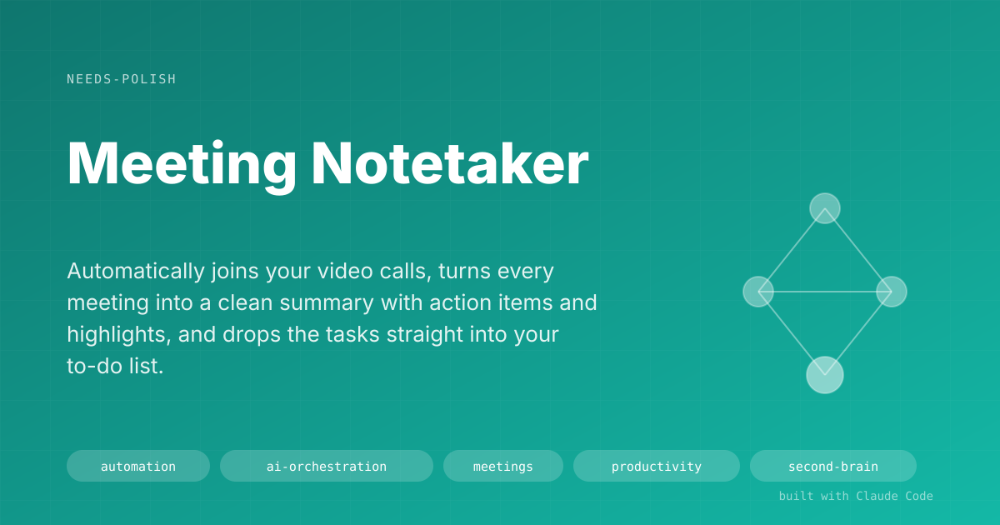

# Meeting Notetaker

> Automatically joins your video calls, turns every meeting into a clean summary with action items and highlights, and drops the tasks straight into your to-do list.

## The Problem

I was using a popular free AI notetaker, but it capped me at five 1-hour meetings per month. Paid plans were expensive for what I actually needed. Worse:

- I couldn't join last-minute meetings that weren't on my calendar.
- Action items stayed trapped in the notes — I had to re-read them and copy each task into my to-do list by hand.
- Output was locked inside a closed tool. I couldn't feed it to other AI tools I was building.

So meetings kept generating friction: the notes existed, but the follow-through didn't.

## The Solution

Meeting Notetaker runs in the background and handles the whole lifecycle:

1. **Joining.** Either automatically from a calendar event, or on demand — paste a meeting link into Telegram and send `/join`.
2. **Recording.** A bot joins the call, records, and transcribes the whole thing.
3. **Processing.** When the meeting ends, the system generates a structured summary: what happened, who committed to what, key decisions, highlights.
4. **Routing.** Action items that belong to me land directly in my personal task inbox. The full summary lands in my personal knowledge base, searchable alongside everything else I've captured.
5. **Browsing.** A local dashboard gives me a fast way to flip through any past meeting — transcript, action items, highlights, metadata — without digging through files.

## Screenshots

*The dashboard index — every processed meeting, one click to the detail view.*

*Cross-meeting action items, grouped by owner. This is the view I actually check every morning.*

*Per-meeting tabs: transcript, action items, highlights, meta.*

## Result

- **No cap**: unlimited meetings, no freemium wall.
- **No manual task entry**: commitments made in calls show up in my inbox the same day.
- **Portable output**: summaries are plain markdown files, usable by any AI tool.
- **Ad-hoc joins**: can capture any meeting with a one-line message, not just scheduled ones.
- **Ballpark time saved**: 15–30 minutes per meeting (skipping manual notes + extracting action items). Over a typical week that's 2–4 hours back.

## Key Decisions

- **Separation of reasoning and execution.** AI handles the interpretation — reading transcripts, extracting commitments, writing summaries. Deterministic Python scripts handle the mechanics — downloading transcripts, file writes, API calls. If every step were AI, compounding small errors would tank reliability. This split keeps the system trustworthy.
- **Markdown as the universal output.** Every summary, action-item list, and highlight is a plain `.md` file. It renders well, versions cleanly in git, and any future AI tool can read it directly — no export step.
- **Polling over webhooks.** Recall's per-bot webhook parameter silently ignored delivery after 3 test cycles. Switched to a 60-second launchd poller — same pattern that works for JobMatch. Pragmatic over elegant.
- **Cross-meeting action-item view.** Individual per-meeting notes are useful, but what I actually need daily is "what do I owe people across every meeting this week?" The aggregate view is the driver.
- **Action items for me auto-route to my task inbox.** The loop closes on its own — meeting ends, commitments are queued for review, no manual step.
- **Real speech-to-text instead of platform captions.** Google Meet / Zoom / Teams provide their own caption stream as a free feature, but their language defaults can quietly mangle non-English speech — Spanish meetings were coming out as phonetic English nonsense. Switched the transcription engine so it listens to the real audio and detects the language itself, handling code-switching mid-sentence (which is how I actually speak).
- **Recovery path for bad transcripts.** Every meeting's audio is saved locally. If a transcript ever comes out wrong — bad language detection, garbled audio, a model regression — a single command rebuilds the transcript from the saved audio and regenerates the summary, while preserving the original speaker turns. Nothing is irrecoverable.
- **Smarter summarizer, stricter rules.** Action items must have an owner and a deadline (or be explicitly marked "no date"). Decisions must be concrete outcomes, not topic labels. Generic phrases like "project updates" or "team alignment" are banned. The result is summaries you can actually act on, in the same language the meeting was held in.

## Under the Hood

**Stack:** Claude Code (orchestration), Recall.ai (meeting bot), Deepgram nova-3 multilingual (live transcription), Groq Whisper-large-v3 (local recovery transcription), Telegram Bot API (command surface), Open Brain MCP (personal knowledge base + GTD), Next.js (dashboard), Python (deterministic tools), Google Calendar (auto-join), Supabase (queue + state), Claude Sonnet 4 via OpenRouter (summarization).

Bot dispatch is handled by the Telegram router edge function (Supabase) which tells Recall to use Deepgram nova-3 with `language: "multi"` so Spanish, English, and code-switched meetings all transcribe cleanly. Processing runs locally via `drain_notetaker_jobs.py` (launchd, every 60s): polls Recall API for finished bots, fetches transcripts, summarizes via Claude Sonnet 4 (~$0.10-0.30/meeting), writes output files, downloads the mixed-mono audio for local archive, and pushes to Open Brain + GTD. If a transcript ever needs rebuilding, `tools/retranscribe_meeting.py` re-runs the saved audio through Groq Whisper-large-v3 and remaps onto the original speaker turns. All credentials live in `.env` — never checked in, never shown.

## How to Demo It

1. Open Telegram. Paste a Google Meet link and send `/join <url>`.
2. Show the bot dialing into the call.
3. End the call. Within a minute or two, the system processes the transcript.
4. Switch to the dashboard — the new meeting is at the top of the index.
5. Open it. Show the tabs: transcript, action items (grouped by owner), highlights, meta.
6. Switch to the cross-meeting action items page. Point out that tasks assigned to me are already queued in my to-do inbox.

## Limitations & Setup

- Recall.ai is a paid service (pay-per-meeting-minute). Not free, but an order of magnitude cheaper than alternatives at my volume.
- Summarization via Claude Sonnet 4 (OpenRouter) costs ~$0.10–0.30 per meeting. Worth it for the quality jump over smaller models.
- Live transcription via Deepgram nova-3 adds a few cents per meeting on top of Recall's per-minute fee — bundled in the Recall bill.
- Local recovery transcription via Groq Whisper is on the free tier — effectively $0.
- The drain poller runs locally via launchd — Mac must be awake for processing.
- Bot dispatch runs server-side (edge function) — works even with laptop closed.
- Single-user system today. Multi-user would need a proper auth layer.
- Spanish and English meetings (including code-switched conversations) work cleanly with the current setup. Other languages depend on Deepgram's coverage and can be forced via the local recovery tool.

## Demo Pitch

> If you sit through a lot of calls and you're constantly losing track of what you committed to, this records every meeting, turns it into a clean summary in whatever language the meeting was actually held in, and drops your action items straight into your task list — without you doing anything. It pays for itself in about a week of meetings.

## Changelog

**2026-05-20 — Multilingual transcription fix and stricter summaries**
- Replaced the platform-caption transcription path (which silently defaulted to English and produced phonetic-English gibberish of Spanish speech) with Deepgram nova-3 in code-switching mode. Spanish meetings now transcribe correctly.
- Added a local recovery tool (`tools/retranscribe_meeting.py`) that rebuilds any meeting's transcript from the saved audio using Groq Whisper-large-v3, preserving the original speaker turns. Idempotent — keeps `.original.md` backups.
- Switched the summary model from GPT-4o-mini to Claude Sonnet 4 and rewrote the prompt to enforce: explicit language detection, owner + verb + deadline on every action item, concrete outcomes (not topic labels) for decisions, a ban on generic filler.
- Verified end-to-end on a 29-minute Spanish meeting whose original summary had captured nothing actionable. Rebuilt summary surfaced the actual decisions (sequential workflow, deadline for stakeholder review) and concrete commitments by name and date.
