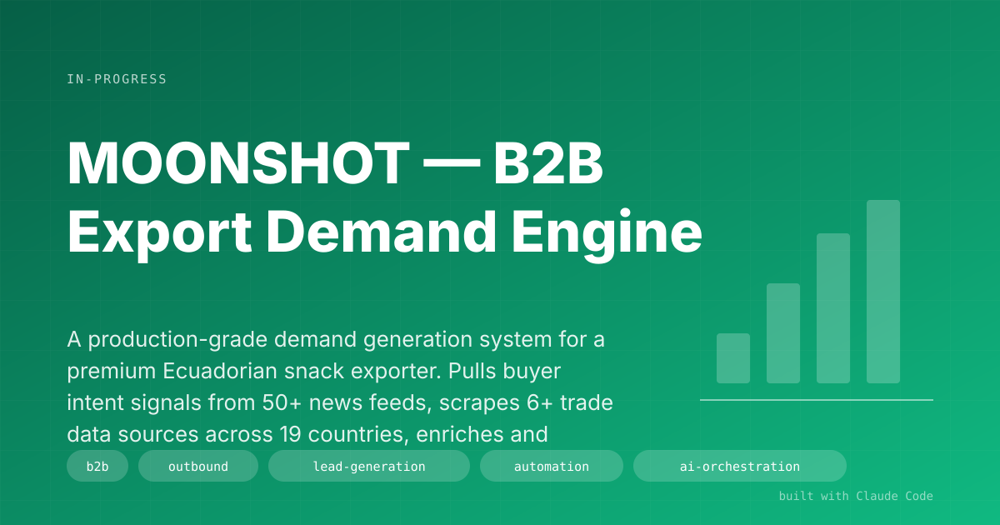

# MOONSHOT — B2B Export Demand Engine

> A production-grade demand generation system for a premium Ecuadorian snack exporter. Pulls buyer intent signals from 50+ news feeds, scrapes 6+ trade data sources across 19 countries, enriches and scores leads against 28 weighted factors, runs multi-language email sequences through Smartlead with GDPR-compliant voice rules, tracks deliverability in a real-time dashboard, and includes a React marketing website. Not a script — a trade operation running on code.

## The Problem
An Ecuadorian snack manufacturer (vacuum-fried plantain and vegetable chips, 60% less fat than traditional fried snacks, HACCP-certified, premium positioning at $15–20/kg FOB) needs to find and convert distributors in Europe, North America, and emerging Asian markets. The problem is not "send cold emails." The problem is an entire trade operation: figure out which countries allow 0% duty for Ecuadorian origin (EU, UK, Canada under FTAs); find real importers of competing products using bill-of-lading data; navigate GDPR and country-specific compliance; write in the buyer's native language (Dutch inboxes respond 3x better than English); warm up sending domains for 21 days before the first real email; survive spam-complaint thresholds; handle sample shipment logistics from Spain or Ecuador when a real prospect replies. Generic lead-gen tooling doesn't do any of this.

## The Solution
A single folder with 30+ tools, 7 numbered workflows, a React dashboard, a React website, a signal scanner running daily, and a reference library of trade knowledge (compliance by country, send-time by country, pitch positioning, tariff advantages). The system runs end to end:

1. **Lead research (01)** — 23 discovery methods. Scrapes ImportYeti (US Bill of Lading data), HMRC uktradeinfo (UK importers), Volza ($125/mo — surfaces NL/SE/FI importers that GDPR hides elsewhere), ProEcuador matchmaking, LinkedIn, Chamber of Commerce directories across 6 LATAM countries (CANACINTRA, ANDI, SOFOFA, CAME), plus a daily signal scanner.
2. **Lead enrichment (02)** — Apollo.io (50 credits/mo free) and Hunter.io (25 lookups/mo free) for emails, plus pattern-guessing with SMTP verification as fallback.
3. **Lead scoring (03)** — 28 weighted factors. Competitor reverse-match +35, confirmed snacks importer +30, LATAM origin +20, contact found +15, buyer-intent signal detected +25, restricted country -50. Produces Tier 1 / Tier 2 / Tier 3 / Skip.
4. **Email sequences (04)** — Tiered templates. Tier 1 gets deep personalization with videos/calls; Tier 2 gets 4-email company-personalized sequences; Tier 3 is semi-automated. Mandatory voice rules: no em dashes, under 125 words, plain text only, zero tracking pixels, data-source transparency ("we saw your ImportYeti profile"), GDPR footers, native-language translation (Dutch, German, Spanish — bad translations penalized harder than English).
5. **Outreach execution (05)** — Delivery through Smartlead on Google Workspace SMTP (not shared IPs). Mandatory 21-day warm-up. DMARC progressive ramp (p=none → quarantine → reject). SPF/DKIM/DMARC verification. MailReach seed testing to confirm inbox placement >90%. Daily SLAs: bounce <2%, open >40%, spam complaints <0.3% (anything higher = full stop).
6. **Response handling (06)** — Classifies replies (Interested / Not Interested / Auto-reply / Bounce / Spam Complaint) and routes to templated responses with product specs, pricing, transit times (22–34 days to EU, 21 to US/Canada), and payment terms (30/70 advance/LOB first orders, Net 30 for repeats).
7. **Sample fulfillment (07)** — Qualifies the prospect (real company + food business + business address + genuine engagement), picks the shipping route (Bilbao Spain hub = 2–4 days, €15–25; Ecuador FedEx = 5–7 days, $80–120), tracks inventory in JSON, and schedules a 5-day follow-up.

On top of all that:

- **Signal scanner** — daily Python job that parses 50+ Google News RSS feeds + search-term feeds across 6 categories (supplier-seeking, product-specific, industry trends, geographic, competitive, regulatory). Scores each signal 1–5, dedupes against a 7-day window, appends to `signals.csv` (**14,453 signals tracked**), and auto-upgrades existing leads with +25 points when intent is detected — potentially jumping them a tier.
- **React marketing website** (`website/`) — React + TypeScript + Vite + Tailwind + shadcn/ui, built on Lovable. Functions as the credibility landing page referenced from cold emails.
- **Operational dashboard** (`dashboard/`) — React + TypeScript + Vite. Two tabs: **Build** (tasks, sprints, goals) and **Ops** (real-time Smartlead metrics: warmup day countdown, campaign status by tier, inbox placement, bounce/open/reply rates, alerts on red-flag thresholds). Syncs state every 60 seconds from Python scripts.
- **Reference library** — compliance-by-country matrix for 11 countries (opt-out vs. opt-in vs. high-risk jurisdictions), GDPR enforcement reality check (7.1B EUR in fines total, zero public cases against small non-EU SMEs, Germany the exception via UWG), send-time + language matrix per country, tariff-advantage playbook quantifying per-container savings ($7k UK, $3.2k Canada), $100M Leads framework, competitor landscape, Australian feasibility screen that refuses the market if MFN duty >15%.

**Master lead database: 850+ companies. Signal database: 14,453 intent signals logged.**

## Screenshots

<!-- broken image dropped at build time (PNG never created):  -->*Real-time Smartlead performance — warmup day, campaign-by-tier status, bounce/open/reply, spam-complaint thresholds with visual alerts.*

<!-- broken image dropped at build time (PNG never created):  -->*50+ news feeds parsed daily. 14,453 intent signals logged. Existing leads auto-upgrade when intent is detected.*

<!-- broken image dropped at build time (PNG never created):  -->*React + Tailwind credibility site, referenced from every cold email.*

## Result
- **End-to-end B2B export operation** running as code. From cold prospect to sample shipment in a single system.
- **850+ qualified leads** in the master database, scored and tiered.
- **14,453 intent signals** tracked over time, not one-shot. Leads upgrade as signals accumulate.
- **19 countries actively monitored** with country-specific compliance, language, and send-time rules.
- **Tariff-advantage playbook** converts Ecuador's 0% duty treaties into dollar savings per container quoted to prospects — a differentiator competing exporters from Asia (12–14% MFN) cannot match.
- **GDPR & anti-spam hygiene built in** — 21-day warmup, DMARC progressive ramp, seed testing, compliance-by-country legal basis, native-language mandatory.
- **Zero-to-inbox-placement process** that most agencies charge $5–10k/month to run.

## Key Decisions
- **Trade data beats contact databases.** ImportYeti (Bills of Lading), UK Trade Info, Volza — real import records are 10x more accurate than "LinkedIn says they buy chips." Reverse-matching on known competitors' shippers is the single highest-signal source.
- **Pay for Volza to beat GDPR redaction.** EU data is legally redacted inside the EU — but Volza mirrors it from non-EU jurisdictions and re-exposes NL/SE/FI importers. $125/mo buys a market other agencies can't see.
- **Voice rules as guardrails, not suggestions.** No em dashes. No tracking pixels. Under 125 words. Plain text. Data-source transparency. These are enforced in every template because they're what separates "a human emailed me" from "another cold blast."
- **Compliance per country, not one-size-fits-all.** The system explicitly distinguishes opt-out countries (US, UK, SE, FI), opt-in countries (NL, BE, DK, NO), and high-risk jurisdictions (DE, AT, CH). LIA templates included. Germany sends bypass the spray tactics because of UWG private-right-of-action risk.
- **Warm up first, always.** 21-day protocol. DMARC p=none → quarantine → reject progressive ramp. Inbox placement tested against MailReach seed list before Day 1 of real sends.
- **Stop-ship thresholds.** Bounce >2%, spam complaints >0.3%, blocklist appearance — full stop, investigate, don't "push through." Reputation is the only compounding asset in outbound.
- **Australian feasibility is a refusal gate.** The Australia screening tool actively refuses markets where MFN duty >15%. Not every country is worth chasing; the system says no for you.

## Under the Hood
**Stack:** Python 3 (BeautifulSoup, Requests, pandas, email-validator, python-dotenv) for scrapers, enrichers, scorers, Smartlead syncers; React + TypeScript + Vite + Tailwind + shadcn/ui for the website and dashboard; Smartlead for email delivery; Apollo + Hunter + ImportYeti + Volza + UK Trade Info for lead data; MailReach + MXToolbox + dmarcian for deliverability.

**Architecture:** WAT framework (Workflows / Agents / Tools). 7 numbered workflows in `workflows/` guide the agent through each pipeline stage. `tools/` holds the 30+ Python scripts. State lives in CSV and JSON files that the dashboard reads every 60 seconds. No database — the filesystem is the database.

## How to Demo It
1. Open the website in a browser — show the credibility landing page.
2. Open the dashboard — show the real-time ops view. Point out the warmup day, the live bounce/open/reply metrics, the alert thresholds.
3. Open `signals.csv` — scroll through 14,453 entries and show how intent signals tie back to the scoring pipeline.
4. Open one of the tier-1 email templates — point out the voice rules (no em dashes, under 125 words, data-source transparency, native language).
5. Open `ref_compliance_by_country.md` — show the 11-country legal-basis matrix. This is where generic lead-gen tools stop and a real trade operation begins.
6. Close with: "850+ leads. 14,453 signals. 19 countries. One folder."

## Limitations & Setup
- Requires paid subscriptions for Volza ($125/mo) and Smartlead; Apollo and Hunter free tiers are usable but limited.
- All `.env` secrets (API keys, Smartlead tokens, DKIM keys) must never leave the project — the folder itself stays private; only this portfolio doc is public.
- Scrapers break when source sites change their DOM — standard maintenance cost of any scraping pipeline.
- The 21-day warmup is a hard prerequisite. There is no shortcut.
- GDPR enforcement risk is low but not zero for an Ecuadorian exporter — the compliance matrix quantifies it, but the final legal basis is the operator's call.

## Demo Pitch
> "This is what B2B export looks like when you run it like an engineering team. Every country has its own compliance and language rules. Every lead is scored against 28 weighted factors. Every signal from the news gets logged and used to upgrade prospects over time. Email delivery is warmed up for 21 days before the first real send. The website is referenced from every email. The dashboard tells us in real time whether the domain is healthy or getting burned. Most agencies charge 5 to 10 grand a month to do a worse version of this."
