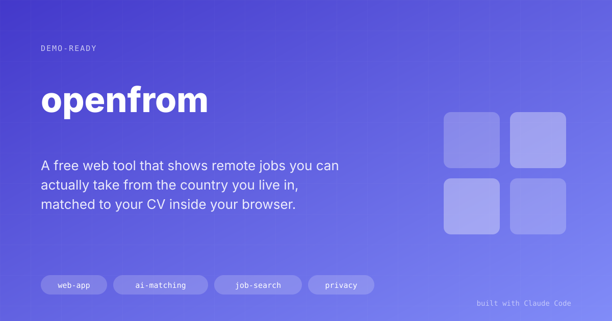

# openfrom

> A free web tool that shows remote jobs you can actually take from the country you live in, matched to your CV inside your browser.

## The Problem
Most jobs labelled "remote" are remote within one country. Of the 20,177 remote jobs openfrom listed on 30 September 2026, 813 (4%) were open to people in every country and 9,675 (48%) only to people in the United States. Job boards rarely say who can apply, so a candidate in Nairobi or Bogotá finds out after reading the ad, or after applying.

## The Solution
Every night a GitHub Actions workflow collects about 20,000 remote jobs from ten public sources, including 92 employers' own career pages. It reads each ad for who can apply: the ad's own words first ("must reside in", "authorized to work in", "solo residentes en", time-zone rules), then the board's location field. It labels each job's role family and industry from the nearest jobs in an earlier AI-labelled study, and publishes a static site.

A visitor pastes or uploads a CV and picks their country. The browser splits the CV into passages, drops the contact details, embeds them with a multilingual model, and ranks only the jobs open to that country. A market map then shows, for the three kinds of role closest to the CV, how many jobs are open to the visitor, who hires, the stated pay range, and the skills those ads ask for that the CV does not mention.

## Screenshots

*Matches for a synthetic Kenyan CV: each job says who can apply, why it matched, and links back to its source.*

## Result
- A live site at [89jdvm.github.io/openfrom](https://89jdvm.github.io/openfrom/), refreshed nightly at no cost: GitHub Pages, GitHub Actions and a GitHub Release for the nightly state.
- 20,177 remote jobs listed after the first nightly refresh; 1,240 open to people in Kenya, 1,501 in Colombia, 1,163 in Ecuador.
- Who-can-apply rules agree with the earlier study's reading on 93% of 8,112 remote jobs, and pass 40 hand-written cases.
- Role family labels agree with checked AI labels 73% of the time on employers held out of training (majority guess: 24%); industry 60% (majority guess: 35%).
- The CV never leaves the browser: no server, accounts, analytics or cookies.

## Key Decisions
- **List the market, filter by place.** Impact-sector jobs were only about 2% of listable remote jobs, so the tool lists all of them and makes "impact sector" a filter; "open to where you live" is the niche that works across the whole market.
- **The ad's words beat the board's tag.** Boards often tag an ad "worldwide" while its text says "US only". Text restrictions win, and an ad that names no place is shown as "location not stated" and hidden by default; an empty country list is never read as open.
- **Loose source rule, written down.** Every public board is listed with credit and a link back unless its terms or robots.txt forbid it. Six were left out for that reason, each with the quote in SOURCES.md.
- **Matching that survives language.** Scoring by the single closest CV passage let a Spanish CV drift to Portuguese-language jobs. The final score blends the whole CV, the two closest passages, and the chance that the CV belongs to each job's role family.
- **A public-safety guard.** A script runs before every commit, push and state upload and refuses private data, full ad text or long strings, so an unattended build could not leak anything.

## Under the Hood
**Stack:** Python (fetchers, rules, labels), Node and transformers.js (embeddings), TypeScript and Vite (site, no framework), scikit-learn, GitHub Actions, GitHub Pages, Playwright.

The same model, revision, quantisation and pooling run in Node at build time and in the browser; a parity test checks the two agree (cosine at least 0.995 on 20 texts). Job vectors ship as int8 with one scale per row, 7.8 MB for 20,000 jobs.

## How to Demo It
1. Open the site, paste a CV (or use one of the synthetic CVs in `e2e/fixtures/`), and check the guessed country.
2. Run the full match; the model downloads once with a progress bar.
3. Show a job card: who can apply, the passage of the CV it matched, the link back to the source.
4. Tick "Show jobs closed to me" to show how much of "remote" is US-only.
5. Open the market map and the About tab (label agreement, sources, privacy).

## Limitations & Setup
- Industry labels sit below the 70% target; seniority, contract type and employer type are shown as approximate.
- Himalayas supplies over half the listings, and its feed is read newest first up to 12,000 jobs a night.
- ReliefWeb and UN Careers are excluded by their terms, so UN and NGO roles are thinner than on specialist boards.
- The full match downloads a 118 MB model once; phones default to a keyword match.

## Demo Pitch
"Paste your CV, say where you live, and see only the remote jobs you can actually apply for, with nothing uploaded. Nearly half of 'remote' jobs turn out to be US-only; this shows you the rest."
