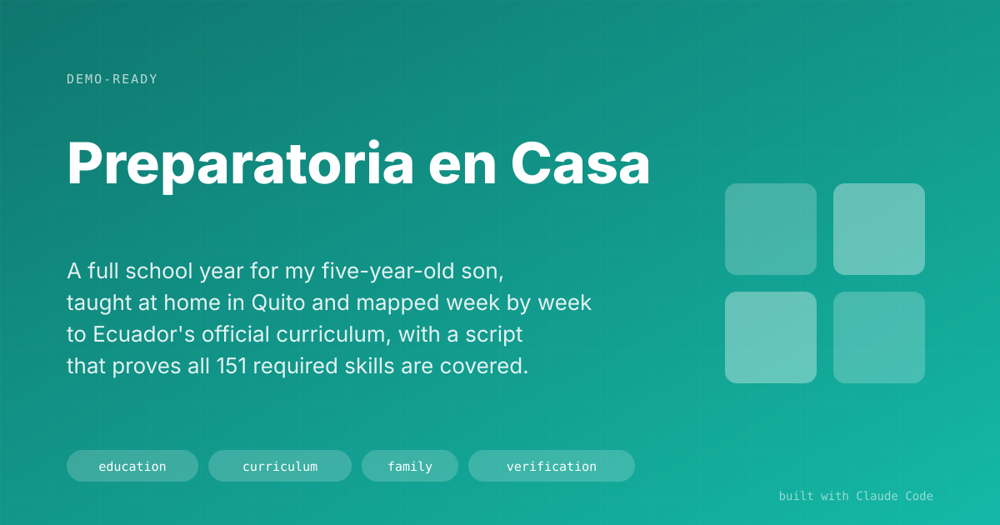

# Preparatoria en Casa

> A full school year for my five-year-old son, taught at home in Quito and mapped week by week to Ecuador's official curriculum, with a script that proves all 151 required skills are covered.

## The Problem

We decided to teach our son his Preparatoria year (the first year of basic education, ages 5 to 6) at home. Ecuador's Ministry of Education publishes a prioritized curriculum with 151 skills for that year. A homeschooling parent has no school to check that the year actually covers them.

The advice online was either generic ("follow the child") or a stack of printables with no link to the official list. I wanted three things a school would give me: a plan I could trust, a way to prove it met the law, and a week that fits in a normal family day.

## The Solution

A plain-language repository in Spanish, split into four documents that change at different speeds:

1. **The firm plan.** A 40-week map, 36 with classes, from 7 September 2026 to 11 June 2027. Each week has one goal and the curriculum skills it covers. It changes only at the mid-year review.
2. **The activity bank.** A menu of activities per block, plus a bank of Friday outings. I read it every Sunday for ten minutes and pick the week.
3. **The daily routine.** Four home days of 2 hours 15 minutes and one outing day. It includes what to do when the day falls apart.
4. **The current week.** Written fresh each Sunday, with the choices already made.

Under that sits a research library of 15 primary sources: 7 legal texts, 4 curriculum documents, and 4 reading-research papers (National Reading Panel 2000, What Works Clearinghouse 2016, and two studies on Spanish speakers). Method notes in the wiki cite those sources to the page.

## Result

- **151 of 151 Preparatoria skills covered**, and a script checks that on demand. `python tools/check_coverage.py --exigir-completo` exits with an error if anyone edits the map and drops a skill, or invents a skill code that is not in the official curriculum.
- **A one-page status view** (`estado/index.html`) that opens offline with a double click: the year at a glance, the first week day by day, and a checklist of what still needs preparing.
- **About US$14 a month in materials.** Only two things have to be made by hand.
- **Two formal letters to the education district**, drafted from the legal library and exported to Word.
- Classes start on 7 September 2026, with the plan finished the week before.

## Key Decisions

**The script does the counting.** A parent counting skills by hand will miss one. The curriculum was extracted into a 296-row CSV, and every week's skill codes are checked against it. The check runs in seconds, so it runs after every edit.

**What the law asks for is kept apart from what we chose.** The ministry's curriculum barely mentions phonological awareness (one skill, LL.1.5.16). The plan gives it 15 minutes a day, four days a week, for 18 weeks, which adds up to 18 hours. That is the effective ceiling reported by the National Reading Panel meta-analysis. The README says plainly that this block goes beyond the curriculum and is a family decision.

**The plan is split by how often each part changes.** Mixing the fixed plan with the weekly menu means every Sunday edit risks the plan. Keeping them in separate files means the firm plan stays firm.

**One method leads.** Juego-Trabajo (learning through play in set corners of the room) is the main method. Montessori and Reggio ideas come in only as layers under it. One lead method keeps weekly choices quick.

**A wrong premise was dropped in the open.** The project started from the belief that we needed a public "umbrella school" to register the year. The legal research did not confirm it, and the README records that it was dropped.

## Under the Hood

**Stack:** Markdown, Python (coverage checker, curriculum extractor, library linter, HTML-to-DOCX export), a static HTML status page.

The repository follows the same Workflows / Agents / Tools layout as my other projects. The library has its own schema and linter (`tools/biblioteca.py lint`), so every note that cites a source points at a file that exists.

## How to Demo It

1. Open `estado/index.html`. Show the year in four stretches and the first week day by day.
2. Open the 40-week map. Pick any week and show its goal and skill codes.
3. Run the coverage check and show `151/151 (100 %)`.
4. Delete one skill code from a week and run it again. It fails with exit code 1 and names the missing skill.
5. Open the phonological-awareness note and show the page-level citations to the reading research.

## Limitations & Setup

- Written in Spanish for one child and one family routine. The structure transfers; the content is ours.
- The coverage check proves each skill is scheduled. Whether our son learned it is judged in the portfolio of his work and the mid-year review.
- Admission to school for 2027-28 still needs confirming with the school.

## Demo Pitch

> "My son's school year is a repository. Every week maps to the official curriculum, and one command proves all 151 required skills are covered. If someone edits the plan and drops one, the check fails. It's the same discipline I'd bring to any compliance-heavy plan: write down the rules, then let a script check them."
